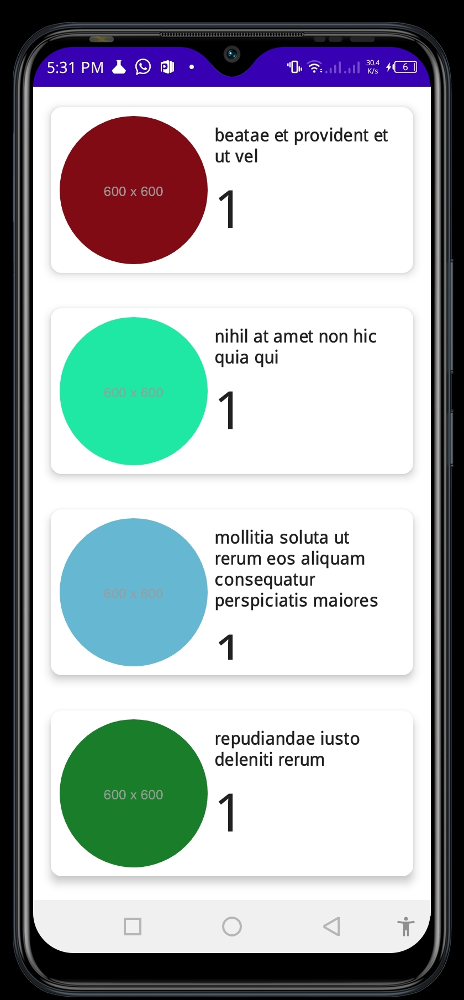
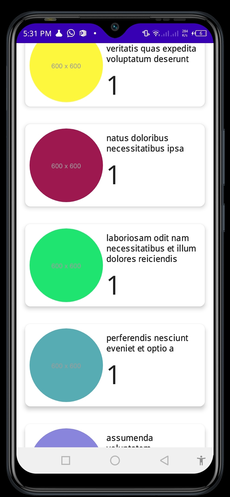

# SocialzApp
- A Jetpack compose SocialzApp consuming REST Posts Api to display a list of available posts

> Screenshots

  
  
  

## Tech Stack
- Jetpack compose
- MVVM
- Retrofit
- Coil library for Image Loading 
- Hilt [Dagger-Hilt]
- Coroutines [Asynchronous Programming]

## Conclusion
- [Happy Hacking!!!]()

## License
> MIT LICENSE

